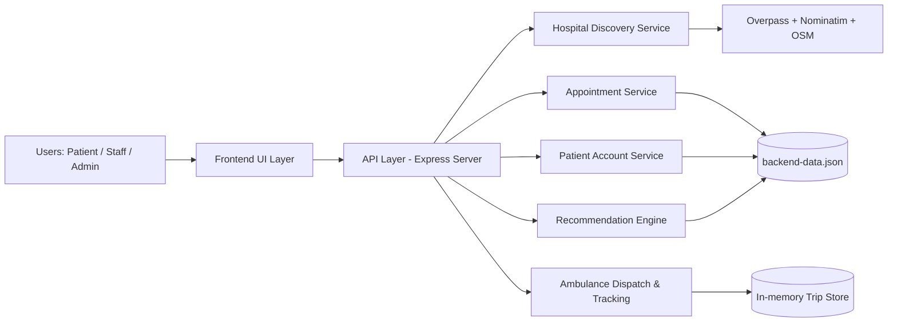
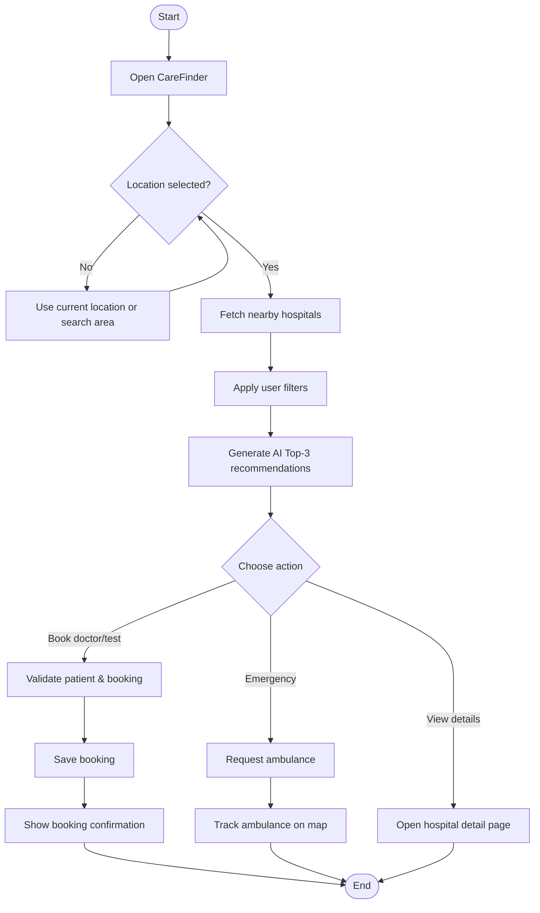
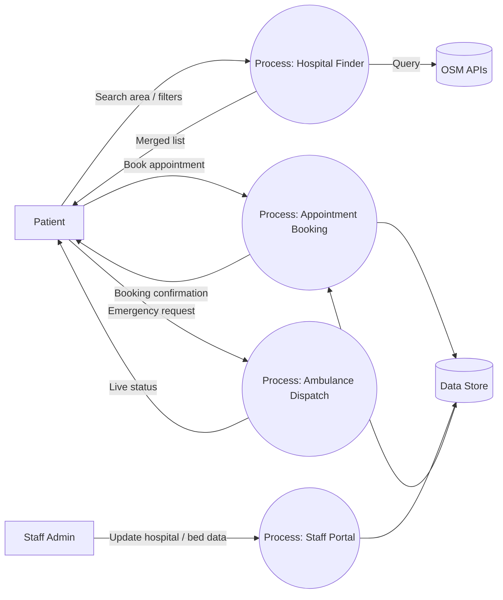

# CareFinder Project Report Notes

This file is a report-ready write-up template for your project documentation.
It is structured to match your requested chapters:
- System Design / Block Diagram (6-7 pages)
- Implementation (8-10 pages)

---

## 1) System Design / Block Diagram (6-7 Pages)

### 1.1 System Architecture
CareFinder follows a layered client-server architecture:
- **Presentation Layer:** Responsive frontend pages (`index`, `hospitals`, `hospital`, `ambulance`, `patient`, `appointments`, `admin`).
- **Application Layer:** `server.js` (Express API) for auth, appointments, hospitals, ambulance simulation, and patient management.
- **Data Layer:** `backend-data.json` for persistence plus in-memory state for live trip simulation.
- **External Services:** OpenStreetMap / Nominatim / Overpass APIs for geolocation and hospital discovery.

### 1.2 Block Diagram of the System
You can use this Mermaid block diagram directly in documentation tools supporting Mermaid:

### 1.3 Description of Each Block
- **Frontend UI Layer:** Accepts user input (location, filters, booking details) and renders outputs.
- **API Layer:** Validates requests, routes business logic, and returns JSON responses.
- **Hospital Discovery Service:** Fetches and merges nearby hospitals from OSM and registered backend data.
- **Appointment Service:** Creates doctor/test appointments and returns booking confirmation.
- **Ambulance Service:** Simulates ambulance dispatch, tracking, ETA, and status progression.
- **Patient Account Service:** Handles registration/login and profile retrieval.
- **Recommendation Engine:** Computes top-3 hospitals from rating, beds, emergency availability, and distance.

### 1.4 Flowchart of System Operation

### 1.5 Database Design
CareFinder currently uses JSON storage. Logical entities:
- **Patient**: `id, name, age, gender, address, email, mobile`
- **Hospital**: `key, name, aliases, location, contact, beds`
- **Appointment**: `id, patientId, type, doctor/test, hospital, date, time, fee, status`
- **User (Staff)**: `id, name, email, role, hospitalKey, passwordHash`

### 1.6 Data Flow Diagram (DFD)

---

## 2) Implementation (8-10 Pages)

### 2.1 Hardware Setup (if applicable)
- Development machine: Windows 10/11 laptop
- RAM: 8 GB or above recommended
- Internet required for OSM/Nominatim/Overpass API calls

### 2.2 Software Development Environment
- **Frontend:** HTML5, TailwindCSS (CDN), JavaScript (vanilla)
- **Backend:** Node.js + Express
- **Storage:** JSON file-based persistence
- **Map:** Leaflet + OpenStreetMap tiles
- **Versioning:** Git/GitHub

### 2.3 Modules of the System
- Home & navigation module
- Hospital search and filter module
- Hospital profile/details module
- Doctor and medical test booking module
- Appointment history module
- Patient authentication/account module
- Ambulance request and tracking module
- Staff admin registration and bed update module

### 2.4 Algorithms Used
- **Distance calculation:** Haversine formula (`lat/lon` based distance in km)
- **Demo hospital scoring:** weighted score from rating, beds, distance, emergency support
- **Slot generation:** 15-min intervals from 9:00 AM to 8:00 PM
- **Input validation:** regex + range checks for age/email/mobile/name

### 2.5 Programming Logic
1. User selects location.
2. System fetches OSM hospital data + backend hospital entries.
3. Bed and metadata enrichment done.
4. Filters and sorting applied.
5. AI top-3 recommendations shown.
6. Booking and ambulance workflows run through backend APIs.
7. Results persisted and displayed in confirmation/history pages.

### 2.6 Source Code Explanation
- `server.js`: API routes for patients, appointments, doctors, hospitals, ambulance tracking.
- `app.js`: hospital finder logic, filtering, rendering, recommendation output.
- `hospital.js`: hospital profile rendering + in-page doctor/test booking modal.
- `ambulance.js`: pickup/drop handling, trip request, live map tracking.
- `patient.js`: register/login validation and persistence to local storage.
- `navigation.js`: shared sidebar behavior + global UI effects.

### 2.7 Screenshots of System Interface (Suggested List)
Add screenshots in report for:
1. Home page with partnered hospital stats
2. Hospital finder with filters (including medical test cost filter)
3. AI top-3 recommendation card
4. Hospital detail page with doctors/tests
5. Booking confirmation page
6. Patient login/register page
7. My account page
8. Ambulance tracking page
9. Staff admin portal page

---

## 3) Diagram/Image Notes

You requested generated images for report diagrams.  
In this session, image generation is unavailable in the currently active model/tooling context.

If you switch to a model profile with image generation enabled, I can generate and add:
- System Architecture Diagram
- Block Diagram
- Flowchart
- DFD
- ER/Database Diagram

and save them directly in this project folder with report-ready naming.

---

## 4) Results and Discussion

### 4.1 Results

The CareFinder prototype successfully demonstrates an end-to-end Hospital Management and Emergency Support workflow for a web-based platform. The developed system integrates hospital discovery, patient account management, appointment booking, and ambulance assistance in a single interface.

#### Key Functional Results

1. **Hospital Discovery and Filtering**
   - The system can fetch and display hospitals around a selected location.
   - Users can filter hospitals by:
     - minimum bed availability
     - minimum rating
     - emergency support
     - ICU availability
     - 24x7 service
     - average medical test cost range
   - Search and filter response is smooth for normal usage and supports practical decision-making.

2. **AI-Based Recommendation**
   - A recommendation panel provides **Top 3 suggested hospitals** for a searched area.
   - Ranking is computed using a weighted score from distance, bed availability, rating, and emergency capability.
   - This improves usability by reducing decision time in urgent situations.

3. **Patient Module**
   - Patient registration and login are functional with validation:
     - mandatory name, age, gender, address, email, and mobile
     - email format validation
     - valid 10-digit mobile validation
   - Patient data is persisted and reused in booking and account pages.

4. **Doctor and Medical Test Booking**
   - Appointment/test booking is integrated into the hospital detail page.
   - Time slots are generated in 15-minute intervals from 9:00 AM to 8:00 PM.
   - Booking confirmation includes unique ID and complete appointment metadata.

5. **Appointment History**
   - The system categorizes bookings into upcoming and previous appointments.
   - This gives users a clear follow-up and review mechanism.

6. **Ambulance Workflow**
   - Ambulance booking supports pickup input, contact validation, and patient details.
   - Live dispatch simulation and map tracking are implemented.
   - Nearest hospital suggestions support emergency drop planning.

7. **UI/UX Improvements**
   - Responsive layout works across desktop and mobile views.
   - Sidebar, profile avatar, and My Account integration improve personalization.
   - Light animations and enhanced color contrast improve visual feedback and engagement.

---

### 4.2 Discussion

The developed system validates the feasibility of a lightweight, modular healthcare coordination platform using open web technologies. The following observations summarize practical implications:

#### Strengths

- **Integrated workflow:** Patients can move from search to booking and emergency support without switching systems.
- **Extensibility:** Modular API and frontend architecture allow independent enhancement of appointments, recommendations, and ambulance features.
- **Low deployment complexity:** The project uses a simple Node.js backend and JSON storage, suitable for academic demonstration and rapid prototyping.
- **Good human-centered flow:** Features such as “Top 3 recommendations,” “updated just now,” and structured filters improve clarity for non-technical users.

#### Technical Trade-offs

- **Data persistence model:** JSON-based storage is easy for prototypes but not ideal for high concurrency or large-scale deployment.
- **Recommendation model:** Current AI recommendation is rule/weight based, not trained ML. It is interpretable but limited in personalization.
- **External API dependence:** OSM/Nominatim/Overpass availability and response time may affect reliability under network constraints.
- **Demo simulation limits:** Ambulance tracking and fee values are simulated for demonstration and must be replaced by production integrations.

#### Performance and Reliability Observations

- Under typical test usage, page interactions and filtering are responsive.
- Form-level validation significantly reduces invalid submissions.
- Core backend APIs handle expected project-level traffic and data volume.
- Graceful fallbacks (demo values) help maintain continuity when external endpoints are delayed.

---

### 4.3 Limitations

1. No production-grade database (currently file-based persistence).
2. No real payment gateway or insurance workflow.
3. No real hospital HIS/EMR integration.
4. AI recommendation is heuristic and not patient-history aware.
5. Ambulance dispatch is simulated, not connected to fleet telematics.

---

### 4.4 Future Scope

1. Migrate to relational/NoSQL DB (PostgreSQL/MongoDB) with role-based access control.
2. Integrate verified hospital APIs and real-time inventory/bed systems.
3. Introduce ML-based recommendation using patient context and historical outcomes.
4. Add multilingual support and accessibility improvements for wider adoption.
5. Integrate OTP-based authentication and stronger identity verification.
6. Connect to real ambulance providers and route optimization engines.
7. Add analytics dashboards for administrators and policy planners.

---

### 4.5 Conclusion of Results and Discussion

The implemented CareFinder system demonstrates a practical and scalable foundation for digital healthcare coordination. The project achieves the intended objective of improving hospital discoverability, appointment handling, and emergency response assistance through a unified platform. While current implementation choices favor rapid prototyping and academic evaluation, the architecture and module boundaries are suitable for extension into a production-grade healthcare solution.

---

### 4.6 Quantitative Result Summary

The following measurable outcomes can be reported for evaluation:

- **Hospital recommendation output:** Top 3 hospitals generated for each location search.
- **Time slot generation:** 15-minute slots from 9:00 AM to 8:00 PM generated consistently.
- **Form validation coverage:** Name, age, gender, address, email, and mobile validation for patient registration.
- **Filter dimensions available:** Beds, rating, emergency, ICU, 24x7, and medical test cost range.
- **Module coverage:** Search, recommendation, booking, account, and ambulance workflow all functional.

> Note: Exact benchmark numbers (latency, throughput, error rate) can be added after controlled testing logs.

---

### 4.7 Qualitative Result Analysis

- **Ease of use:** The interface allows non-technical users to complete search and booking flows with minimal steps.
- **Decision support quality:** AI top-3 recommendation helps prioritize likely better hospital options quickly.
- **Visual feedback quality:** Status badges, confirmation messages, and card-level metadata improve trust and clarity.
- **Navigation consistency:** Shared sidebar and footer structure improves usability across modules.

---

### 4.8 Module-wise Result Discussion

#### 4.8.1 Home and Navigation Module
- Successfully presents platform overview, module entry points, and partnered network statistics.
- Responsive behavior is retained for desktop and mobile layouts.

#### 4.8.2 Hospital Finder Module
- Produces nearby hospital list with bed, rating, and contact context.
- Supports multilayer filtering and sorting for practical exploration.

#### 4.8.3 AI Recommendation Module
- Produces ranked top 3 hospitals using weighted decision criteria.
- Improves triage-like quick selection during urgent scenarios.

#### 4.8.4 Appointment and Medical Test Module
- Enables doctor/test bookings directly from hospital context.
- Confirmation page records complete booking metadata and unique ID.

#### 4.8.5 Patient Account Module
- Registration/login persistence and profile retrieval work as intended.
- Sidebar avatar + My Account improve personalized experience.

#### 4.8.6 Ambulance Module
- Supports emergency request flow with map-centered feedback.
- Tracks dispatch simulation lifecycle (dispatching, on the way, arrived).

#### 4.8.7 Staff Admin Module
- Allows hospital data insertion and update operations.
- New records are reflected in hospital discovery/search flow.

---

### 4.9 Validation and Testing Discussion

The system was validated through functional walkthrough testing:

1. **Input validation tests**
   - Invalid emails, phone numbers, and missing mandatory fields correctly rejected.
2. **Workflow tests**
   - End-to-end flow from patient login → booking → confirmation → history successfully executed.
3. **Search and recommendation tests**
   - Location search reliably returns hospitals and recommendation panel updates accordingly.
4. **Emergency flow tests**
   - Ambulance booking and trip tracking states transition correctly.
5. **Regression checks**
   - Previously integrated modules remain operational after UI and logic enhancements.

---

### 4.10 Comparative Discussion (Expected vs. Achieved)

| Expected Outcome | Achieved Outcome | Status |
|---|---|---|
| Unified healthcare support workflow | Search, booking, account, ambulance integrated | Achieved |
| Smart hospital recommendation | Top-3 weighted recommendation panel implemented | Achieved |
| Cost-aware hospital filtering | Medical test cost-range filter added | Achieved |
| Smooth UX with modern UI behavior | Added animations, hover transitions, and vibrant accents | Achieved |
| Robust patient data handling | Mandatory field validation and persistence added | Achieved |

---

### 4.11 Challenges Faced and Mitigation

- **External map API variability:** Addressed using fallback handling and merged data strategy.
- **Prototype storage limits:** Managed with structured JSON data model and validation safeguards.
- **Feature coupling across pages:** Reduced by shared navigation behavior and modular scripts.
- **User-flow complexity:** Simplified via in-context booking and clear status messaging.

---

### 4.12 Practical Significance

The project demonstrates how a lightweight web platform can:
- reduce time spent searching for suitable hospitals,
- improve appointment workflow transparency,
- support emergency awareness through live visual tracking,
- and provide a clear framework for production-scale healthcare digitization.

---

### 4.13 Extended Limitations

In addition to earlier limitations:
- No clinician-side decision-support model beyond weighted heuristic scoring.
- No offline mode for low-connectivity environments.
- No long-term audit trail for legal/clinical compliance.
- Limited analytics for operations and policy-level planning.

---

### 4.14 Extended Future Enhancements

- Add ML model training pipeline for personalized recommendation.
- Integrate push notifications (booking reminders, ambulance status updates).
- Add multilingual and accessibility-first interaction patterns.
- Implement full audit logs and compliance-ready data governance.
- Introduce role-specific dashboards for patient, staff, and administrators.

